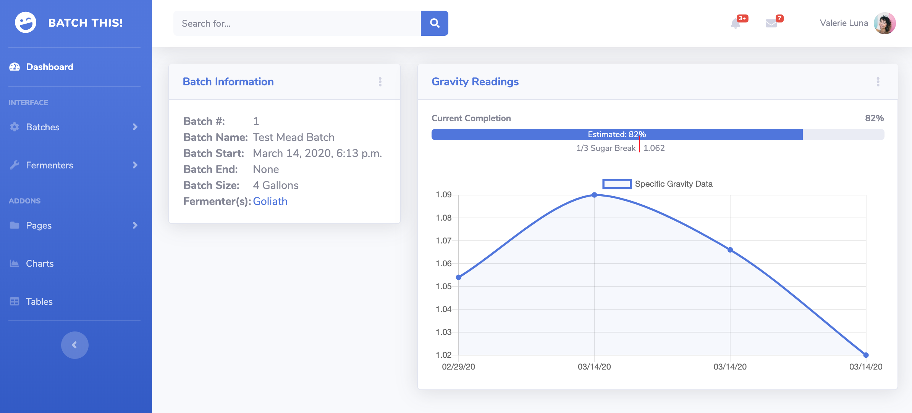
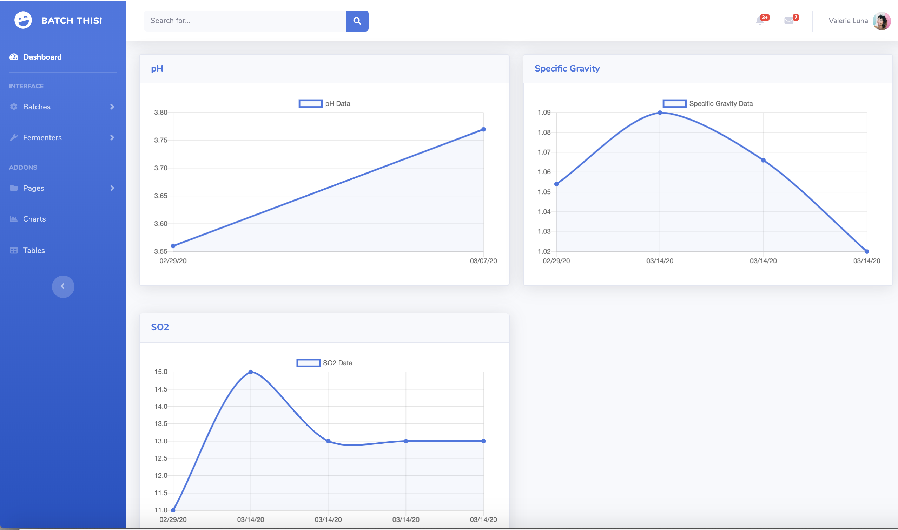

# Batch This!
An online django-based app for journaling and tracking the making of low-alcoholic beverages, including graphs.  Primarily Wine and Mead, but also others like Cider and Beer.  

Each "batch" is a specific recipe that can be used in one fermenter, or multiple.  It will also track fermenter status and maintenance.  

Not a recipe builder, but meant for everything after the recipe.

Lots of features and possibilities.

Working on now:
* Fermenter workflow and maintenance
* Batch tracking and testing
* Graphing of tests
* Detailed note taking/journaling (Taste Notes, Fermentation Notes, etc)
* Addition Tracking (nutrients, adjuncts, fruits, O2, etc)

Future:
* Import recipes from Beersmith
* Workflow Engine - Task assignment for Batch/Fermenter Maintenance or Next Steps
* Inventory Tracking??
* Wine tools and formulae (i.e. SO2 charts, Brix/Gravity conversions, etc)

