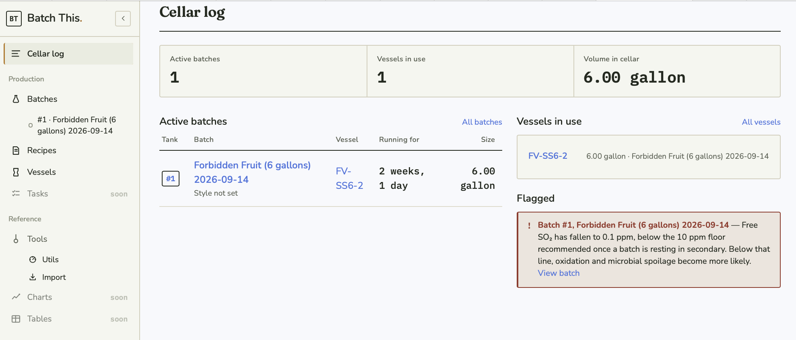
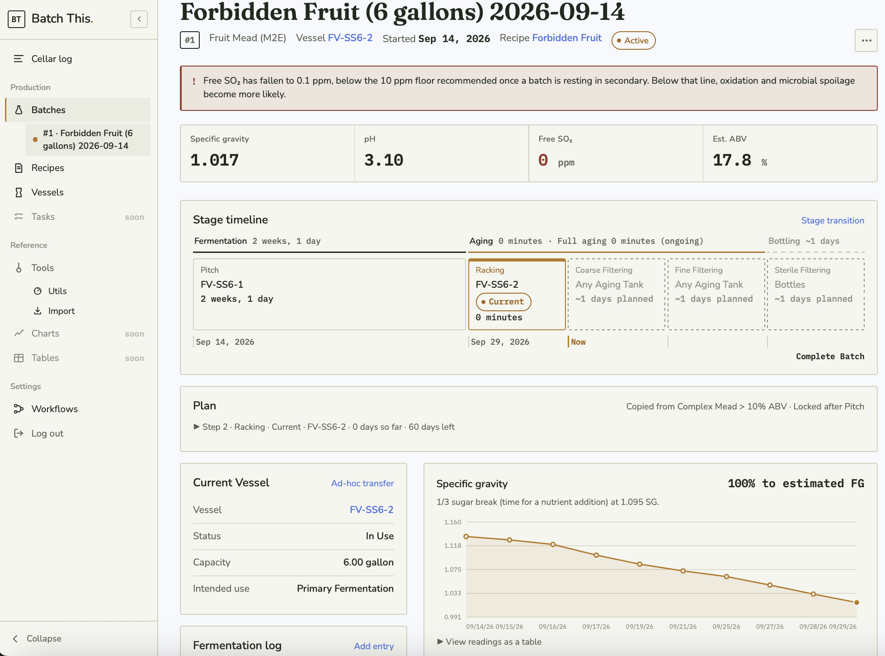
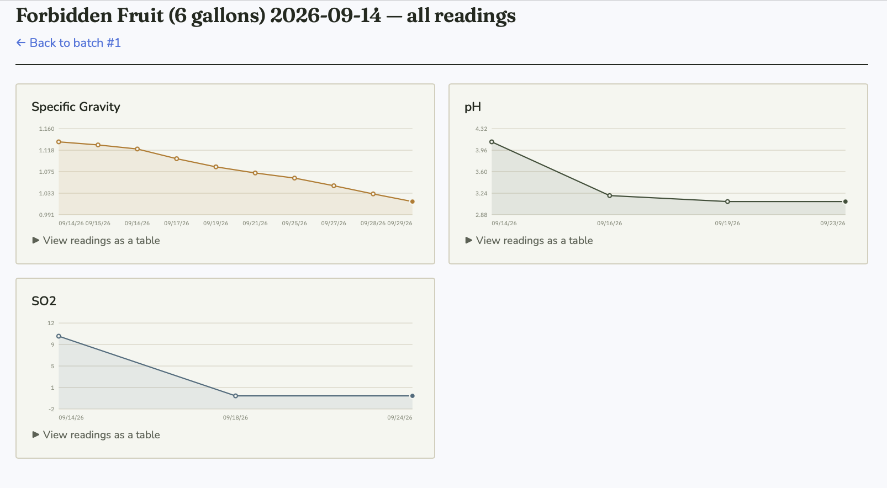
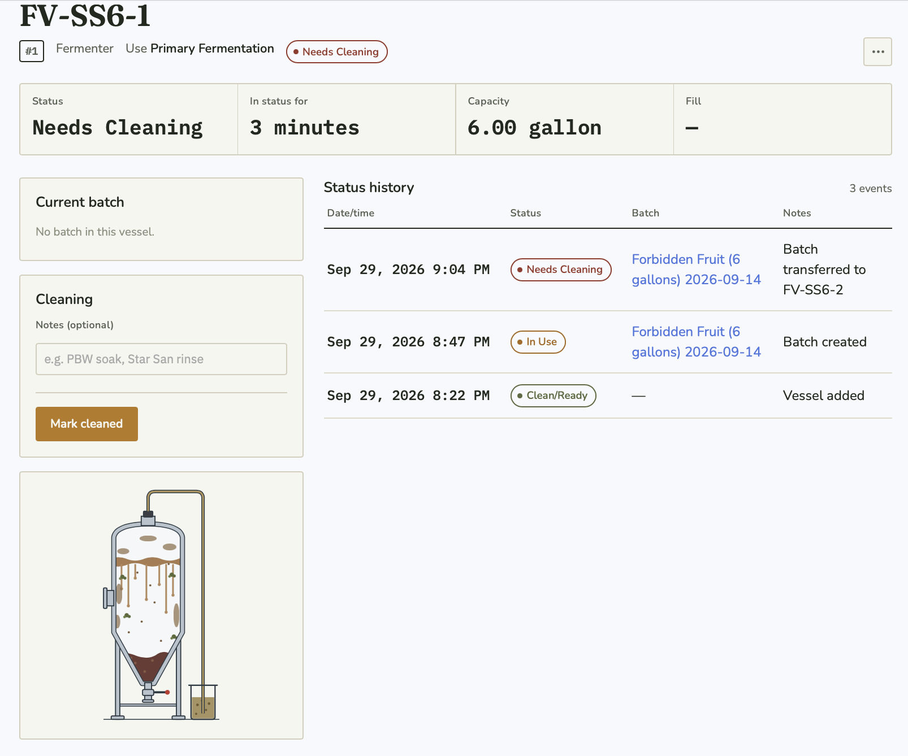
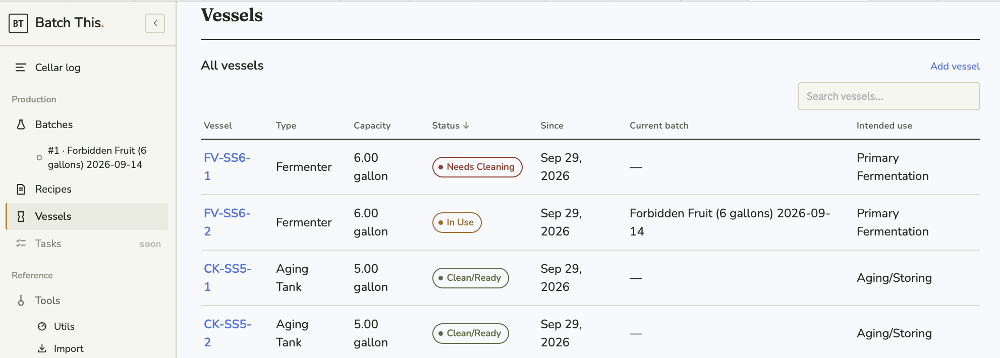

# Batch This!
An online django-based app for journaling and tracking the making of low-alcoholic beverages, including graphs.  Primarily Wine and Mead, but also others like Cider and Beer.  

Each "batch" is a specific recipe that can be used in one fermenter, or multiple.  It will also track fermenter status and maintenance.  

Not a recipe builder, but meant for everything after the recipe.

Lots of features and possibilities.

## Getting Started:
1. Clone the app to a machine running Docker
   - `git clone https://github.com/apaxson/batchthis.git`
   - `cd batchthis`
2. Create your settings file from the example (keep the example for next time)
   - `cp .env.example .env`
3. Edit `.env` **before the first start** with your preferred editor (vim, nano, etc) - `nano .env`
   - `SECRET_KEY` - replace the placeholder. Generate one with
     `python3 -c "import secrets; print(secrets.token_urlsafe(50))"`
   - `POSTGRES_PASSWORD` - choose a password (generate one the same way). It only takes effect
     when the database is first created, so set it now. Leave `POSTGRES_USER` as `batchthis`.
   - `DJANGO_ALLOWED_HOSTS` - every host name the site is reached by, comma-separated, with
     no ports and no `http://`, e.g. `127.0.0.1,localhost,batchthis,batchthis.example.com`
   - `DJANGO_CSRF_TRUSTED_ORIGINS` - only if the site is served over HTTPS (e.g. behind a
     reverse proxy): the full origin, e.g. `https://batchthis.example.com`
   - Optional: `APP_PORT` (default 8080)
4. Build and start the app (it sets up the database on first start)
   - `docker compose up -d --build`
5. Check the host names took effect - it should print the list from step 3
   - `docker compose exec app python -c "import django; django.setup(); from django.conf import settings; print(settings.ALLOWED_HOSTS)"`
6. Create the admin user
   - `docker compose exec app python manage.py createsuperuser`
7. Open the site at `http://<your host>:8080/batchthis/` (or your `APP_PORT`)

### Changing settings later
- Edit `.env`, then run `docker compose up -d` - it recreates the app with the new values.
  `docker compose restart` does **not** pick up changes to `.env`.
- Set host names only in `.env` (`DJANGO_ALLOWED_HOSTS`), not in `meadery/settings.py`.
- To change the database password after the first start, change it inside the database too
  (`docker compose exec db psql -U batchthis -d batchthis`, then `\password batchthis`) -
  editing `.env` alone isn't enough.
- After pulling new code: `docker compose up -d --build`

Main Dashboard:

Batch Details Page

Batch Test Report

VesselStatus:

Vessel Listing:

Example Login Screen

