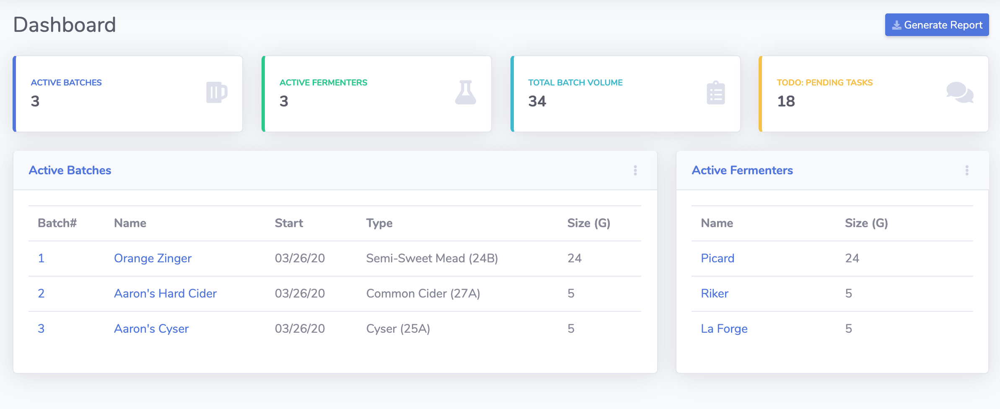
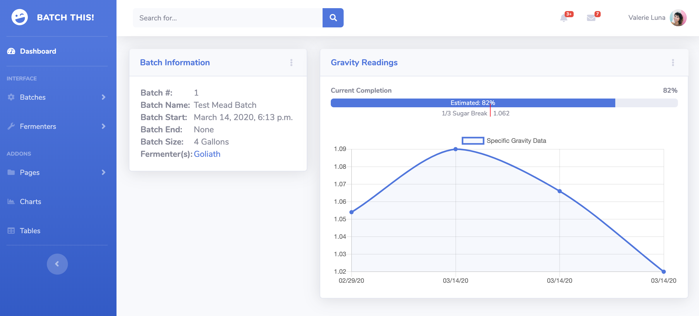
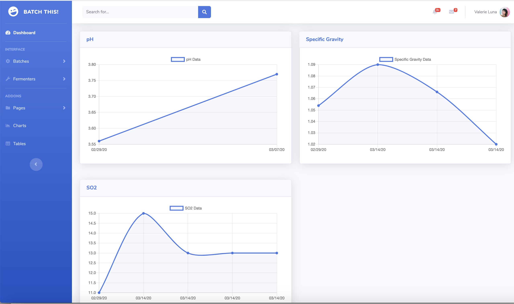
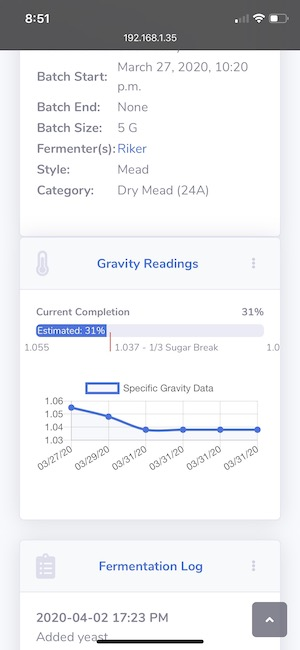
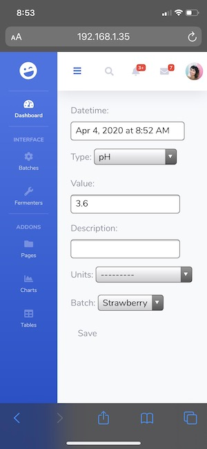

# Batch This!
An online django-based app for journaling and tracking the making of low-alcoholic beverages, including graphs.  Primarily Wine and Mead, but also others like Cider and Beer.  

Each "batch" is a specific recipe that can be used in one fermenter, or multiple.  It will also track fermenter status and maintenance.  

Not a recipe builder, but meant for everything after the recipe.

Lots of features and possibilities.

## Getting Started:
1. Clone the app to a filesystem running Docker
   - `git clone https://github.com/apaxson/batchthis.git`
2. Rename .env.example to .env
   - `mv .env.example .env`
3. Update your DB User and Password using preferred editor (vim, nano, etc)
    - `nano .env`
4. Run the app for the first time
   - `docker compose up --detach`
5. Create the admin user
   - `docker compose exec app python manage.py createsuperuser`
6. Generate a new secret key for Django to use (copy to clipboard for next step)
    - `docker compose exec app python -c "from django.core.management.utils import get_random_secret_key; print(get_random_secret_key())"`
7. Copy the secret key and update DJANGO_SECRET in your preferred editor (vim, nano, etc)
   - `nano .env`
8. Restart your containers to load the new key
    - `docker compose restart`

Main Dashboard:

Batch Details Page

Batch Test Report

Example Login Screen

Mobile Ready:

